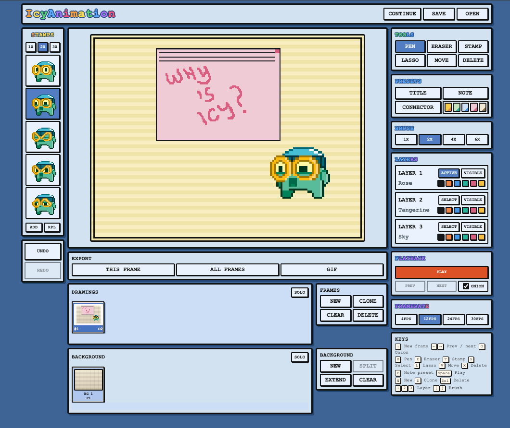

# IcyAnimation

IcyAnimation is a lightweight browser animation tool built to echo the low-resolution feel and frame-by-frame workflow of Nintendo DSi Flipnote while keeping its own visual identity.



## Features

- Native `256x192` pixel stage with crisp scaling
- Explicit previous/next frame controls plus `←` / `→` shortcuts
- Frame strip for adding, duplicating, clearing, and deleting frames
- Background strip with held background cells, `Split`, and `Extend`
- Three tintable drawing layers with visibility toggles
- Pen, eraser, stamp, select, lasso selection, move, and delete-object tools
- Presentation presets for title cards, notes, and connector lines
- Note presets render as overlay cards and can carry attached per-layer ink
- Onion-skin preview and adjustable playback speed
- Undo / redo history
- Continue last project from browser autosave
- Save / open project files in `.icy` format
- Transparent PNG export for the current frame
- Transparent PNG export for all frames
- Animated GIF export

## Run

Open [/Volumes/Storage/Help/index.html](/Volumes/Storage/Help/index.html) directly in a browser, or serve the folder locally:

```bash
python3 -m http.server 4173
```

Then visit [http://localhost:4173](http://localhost:4173).

## Desktop App

The same codebase can run as a desktop app for macOS and Windows.

Install dependencies:

```bash
npm install
```

Run the desktop wrapper locally:

```bash
npm run dev:desktop
```

Build an unpacked desktop app for the current platform:

```bash
npm run build:icon
npm run pack
```

Build release artifacts:

```bash
npm run dist:mac
npm run dist:win
```

Notes:

- The Electron wrapper keeps the renderer sandboxed with `contextIsolation: true` and `nodeIntegration: false`.
- Packaged mode uses native file dialogs for `Save`, `Open`, GIF export, PNG export, and all-frame export folders.
- Native installers are easiest to produce on the matching operating system or in CI for that target.
